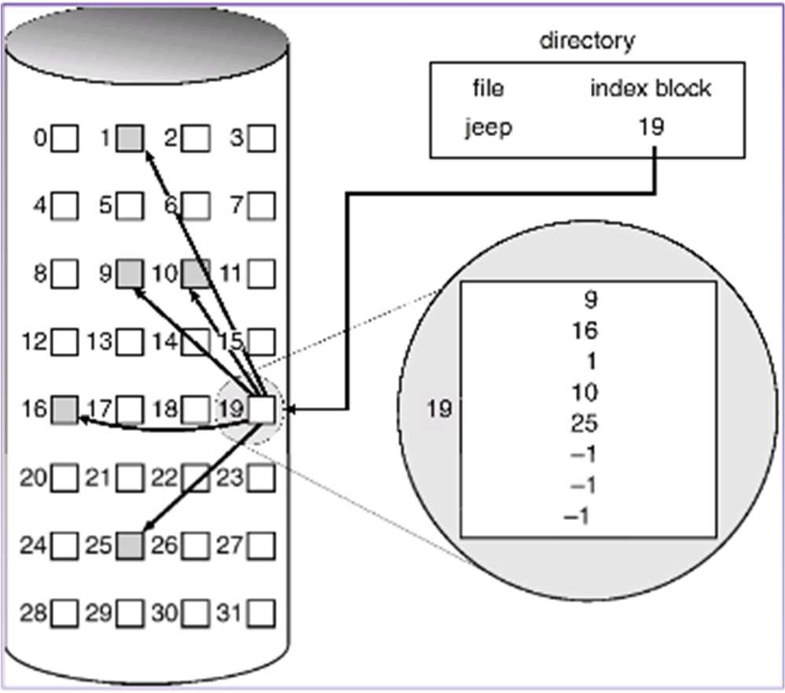

# 文件系统

## 文件系统结构

在操作系统中，文件是指具有文件名的一组相关元素的有序序列，是一段程序或数据的集合，而文件系统是操作系统的一部分，主要功能是管理存储在磁盘 等物理介质中的文件的存储、检索、更新，提供安全可靠的共享和保护手段，并且方便用户使用。

文件如何存储在磁盘上呢?磁盘可以看成一个个磁盘块(扇区)组成，每个磁盘块的大小固定(512B-4K)，因此存储文件的一个关键就是记录文件在哪些磁盘块上。通常有三种方法来分配和记录文件的磁盘块，连续分配、链表分配和索引分配。



从图中可以看出，文件有索引节点描述，可以读 index block 中的数据，可以得到 jeep 文件所在的块分别是： 9, 16, 1, 10, 25，将他们连起来就是 jeep 文件的全部内容。

典型的 linux 文件系统中磁盘主要包括四个区域：启动区、超级块 (superblock)区、索引节点(inode)区和数据(data block)区。

- 超级块区：超级块区中存储两个位图(bitmap)，分别用来表示索引结点和数据块的使 用情况。索引结点位图中的每个 bit 表示对应的索引结点是否占用，数据块位图 中的每个 bit 表示对应的数据块是否占用。

- 索引节点区：每个索引结点中存储着一个文件或目录的描述信息，每个文件和目录都有一个 inode 数据结构，包括文件系统中文件的基本属性：文件大小、inode 号、存放的 block 数目和具体 block 编号等相关信息。 0 号索引结点中存储的是根目录的信息，应在格式化时设置。

- 数据区：存放文件的内容，若文件过大，会占用多个 block。每个目录下均有一个名称为“.”的目录，即为本身。除根目录外，每个目录下均有一个名称为“..”的目录，即为上级目录。

就像一本书有封面、目录和正文一样。在文件系统中，超级块就相当于封面，从封面可以得知这本书的基本信息；inode 块相当于目录，从目录可以得知各章 节内容的位置；而数据块则相当于书的正文，记录着具体内容。

本章内容特别特别特别多。。。而且特别特别特别复杂。。。所以。。。首先我们先在用户态实现一个 shell 吧（相对来说这比较简单，也不需要什么前置知识。。。

## 创建命令行

创建 **usr/rust/src/bin/sh.rs** ：

```rust
#![no_std]
#![no_main]
#![feature(alloc)]

extern crate alloc;

#[macro_use]
extern crate rust;

use alloc::vec::Vec;
use core::ptr;

use rust::io::get_line;
use rust::syscall::sys_exec;

// IMPORTANT: Must define main() like this
#[no_mangle]
pub fn main() -> i32 {
    println!("Rust user shell");
    let mut history = Vec::new();

    loop {
        print!(">> ");
        let cmd = get_line(&mut history);
        // split cmd, make argc & argv
        // to-do: handle quotes
        let cmd = cmd.replace(' ', "\0") + "\0";
        let cmds: Vec<&str> = cmd.split('\0').collect();
        let mut ptrs: Vec<usize> = cmd
            .split('\0')
            .filter(|s| !s.is_empty())
            .map(|s| s.as_ptr() as usize)
            .collect();
        if ptrs.is_empty() {
            continue;
        }
        sys_exec(ptrs[0] as *const u8);
    }
}
```

这里实现的功能是读取一行的内容（执行一个用户程序）并执行。那么现在我们读取和执行的相关函数和 syscall ：

```rust
// in usr/rust/src/io.rs

use alloc::string::String;
use alloc::vec::Vec;

pub fn putc(c: u8) {
    syscall::sys_write(c);
}

const BEL: u8 = 0x07u8;
const BS: u8 = 0x08u8;
const LF: u8 = 0x0au8;
const CR: u8 = 0x0du8;
const ESC: u8 = 0x1bu8;
const DEL: u8 = 0x7fu8;

pub fn get_line(history: &mut Vec<Vec<u8>>) -> String {
    let mut cursor = 0;
    let mut line_vec = Vec::with_capacity(512);
    let mut history_index = history.len();
    loop {
        match getc() {
            BS | DEL => {
                // Backspace
                if cursor > 0 {
                    cursor -= 1;
                    line_vec.remove(cursor);

                    putc(BS);
                    for byte in &line_vec[cursor..] {
                        putc(*byte);
                    }
                    putc(b' ');
                    for _i in cursor..line_vec.len() {
                        putc(ESC);
                        putc(b'[');
                        putc(b'D');
                    }
                    putc(ESC);
                    putc(b'[');
                    putc(b'D');
                } else {
                    putc(BEL);
                }
            }
            CR | LF => {
                // Return
                putc(CR);
                putc(LF);
                break;
            }
            ESC => {
                match getc() {
                    b'[' => {
                        match getc() {
                            b'D' => {
                                // Left arrow
                                if cursor > 0 {
                                    cursor -= 1;
                                    putc(ESC);
                                    putc(b'[');
                                    putc(b'D');
                                } else {
                                    putc(BEL);
                                }
                            }
                            b'C' => {
                                // Right arrow
                                if cursor < line_vec.len() {
                                    cursor += 1;
                                    putc(ESC);
                                    putc(b'[');
                                    putc(b'C');
                                } else {
                                    putc(BEL);
                                }
                            }
                            direction @ b'A' | direction @ b'B' => {
                                if direction == b'A' && history_index > 0 {
                                    // Up arrow
                                    history_index -= 1;
                                } else if direction == b'B' && history.len() > 0 // usize underflow
                                    && history_index < history.len() - 1
                                {
                                    // Down arrow
                                    history_index += 1;
                                } else {
                                    putc(BEL);
                                    continue;
                                }

                                for _ in 0..line_vec.len() {
                                    putc(ESC);
                                    putc(b'[');
                                    putc(b'D');
                                }
                                for _ in 0..line_vec.len() {
                                    putc(b' ');
                                }
                                for _ in 0..line_vec.len() {
                                    putc(ESC);
                                    putc(b'[');
                                    putc(b'D');
                                }
                                line_vec = history[history_index].clone();
                                cursor = line_vec.len();
                                for byte in &line_vec {
                                    putc(*byte);
                                }
                            }
                            _ => {
                                putc(BEL);
                            }
                        }
                    }
                    _ => {
                        putc(BEL);
                    }
                }
            }
            byte if byte.is_ascii_graphic() || byte == b' ' => {
                line_vec.insert(cursor, byte);
                for byte in &line_vec[cursor..] {
                    putc(*byte);
                }
                cursor += 1;
                for _i in cursor..line_vec.len() {
                    putc(ESC);
                    putc(b'[');
                    putc(b'D');
                }
            }
            _ => {
                // unrecognized characters
                putc(BEL);
            }
        }
    }

    if line_vec.len() > 0 {
        history.push(line_vec.clone());
    }
    String::from_utf8(line_vec).unwrap_or_default()
}

pub const STDIN: usize = 0;

pub fn getc() -> u8 {
    let mut c = 0u8;
    loop {
        let len = syscall::sys_read(STDIN, &mut c, 1);
        match len {
            1 => return c,
            0 => continue,
            _ => panic!("read stdin len = {}", len),
        }
    }
}

// in usr/rust/src/io.rs

pub fn sys_read(fd : usize, base : *const u8, len : usize) -> i32 {
    sys_call(SyscallId::Read, fd, base as usize , len , 0)
}

pub fn sys_exec(path : *const u8) {
    sys_call(SyscallId::Exec, path as usize, 0, 0, 0);
}

enum SyscallId {
    Read = 63,
    Write = 64,
    Exit = 93,
    Exec = 221,
}
```

修改 Makefile，将用户程序和 shell 打包成 img ：

```makefile
# 变更

usr_path := usr

export SFSIMG = $(usr_path)/rcore32.img

.PHONY: all clean rust build

all: rust build

# 新添

build: $(out_img)

$(out_img): rust
	@rcore-fs-fuse $@ $(out_dir) zip

rcore-fs-fuse:
ifeq ($(shell which rcore-fs-fuse),)
	@echo Installing rcore-fs-fuse
	@cargo install rcore-fs-fuse --git https://github.com/rcore-os/rcore-fs --rev c611248
endif
```

执行 `make` 生成的 **rcore32.img** 就是我们的目标文件。至此用户部分已经完成，接下来开始进行内核的支持。
